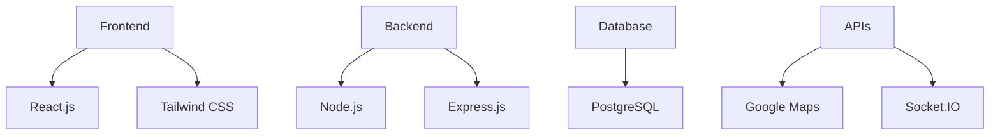
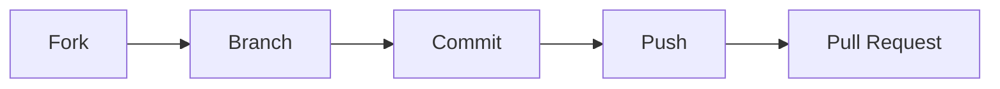

<p align="center">
  
# 🌟 FoodShare Connect

### _Bridging the gap between surplus and scarcity_

[](https://github.com/yourusername/food-share)
[](https://github.com/yourusername/food-share)
[](https://choosealicense.com/licenses/mit/)
[](https://github.com/yourusername/food-share/issues)

</p>

---

<p align="center">
  <a href="#rocket-project-overview">Overview</a> •
  <a href="#sparkles-key-features">Features</a> •
  <a href="#wrench-tech-stack">Tech Stack</a> •
  <a href="#zap-quick-start">Quick Start</a> •
  <a href="#factory-architecture">Architecture</a> •
  <a href="#people_holding_hands-team">Team</a>
</p>

---

## 🚀 Project Overview

FoodShare Connect is a revolutionary platform that bridges the gap between food surplus and scarcity. Our mission is to create a seamless connection between restaurants/households with excess food and the NGOs/individuals who need it most. Through real-time updates, smart matching, and efficient delivery coordination, we're making food donation more accessible than ever.

## ✨ Key Features

### 🏛️ NGO Portal
```javascript
{
  "features": [
    "Smart Dashboard",
    "Real-time Food Alerts",
    "Donation Management",
    "Analytics Dashboard",
    "Profile Customization"
  ],
  "benefits": [
    "Efficient Resource Allocation",
    "Streamlined Operations",
    "Impact Tracking"
  ]
}
```

### 🎁 Donor Hub
```javascript
{
  "features": [
    "Quick Food Listing",
    "Donation Tracking",
    "Impact Metrics",
    "Schedule Management",
    "Real-time Updates"
  ],
  "benefits": [
    "Reduced Food Waste",
    "Community Impact",
    "Effortless Donating"
  ]
}
```

### 👑 Admin Command Center
```javascript
{
  "features": [
    "NGO Verification",
    "System Monitoring",
    "User Management",
    "Analytics Dashboard",
    "Email Automation"
  ],
  "benefits": [
    "Platform Integrity",
    "Quality Control",
    "Efficient Management"
  ]
}
```

## 🛠️ Tech Stack



## ⚡ Quick Start

### 🔧 Prerequisites
```

### 🚀 Installation Steps

1️⃣ **Clone & Setup**
```bash
# Clone the repository
git clone https://github.com/yourusername/foodshare-connect.git

# Navigate to project directory
cd foodshare-connect

# Install dependencies
npm install
```

2️⃣ **Environment Configuration**
```bash
# Create environment file
cp .env.example .env

# Configure your environment variables
nano .env
```

3️⃣ **Database Setup**
```bash
# Create database
createdb foodshare_db

# Run migrations
npm run migrate
```

4️⃣ **Launch Application**
```bash
# Start development server
npm run dev

# Start in production
npm start
```

## 🏭 Architecture

```ascii
┌────────────────┐       ┌────────────────┐
│    Frontend    │◄─────►│  API Gateway   │
└────────────────┘       └────────┬───────┘
                                 ┌┴┐
                          ┌──────┴─┴──────┐
                          │   Services    │
                          └──────┬─┬──────┘
                                ┌┴┐
                         ┌──────┴─┴──────┐
                         │   Database    │
                         └──────────────┘
```

## 🤝 Team

### 💻 Backend Warriors
```python
backend_team = {
    "Roshni Dholariya": {
        "role": "Backend Architect",
        "specialization": ["API Development", "System Design"]
    },
    "Harsh Gangani": {
        "role": "Backend Developer",
        "specialization": ["Database Design", "Server Implementation"]
    }
}
```

### 🎨 Frontend Craftsmen
```python
frontend_team = {
    "Saloni Gadhiya": {
        "role": "Frontend Developer",
        "specialization": ["UI Implementation", "User Experience"]
    },
    "Bhargav Dave": {
        "role": "Frontend Developer & Technical Writer",
        "specialization": ["React Development", "Documentation"]
    }
}
```

## 📈 Project Status


## 🤝 Contributing



<p align="center">
  <b>Made with ❤️ by Team FoodShare Connect</b><br>
  <i>Want to join us in making a difference? Check out our <a href="#contributing">contributing guidelines</a>!</i>
</p>

```ascii
  _____              _  _____ _                      
 |  ___| __ ___   __| |/ ____| |__   __ _ _ __ ___ 
 | |_ | '__/ _ \ / _` | (___ | '_ \ / _` | '__/ _ \
 |  _|| | | (_) | (_| |\___ \| | | | (_| | | |  __/
 |_|  |_|  \___/ \__,_|____/|_| |_|\__,_|_|  \___|
                                                    
```
